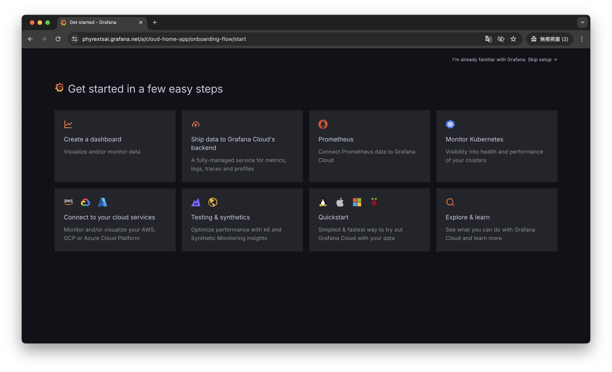
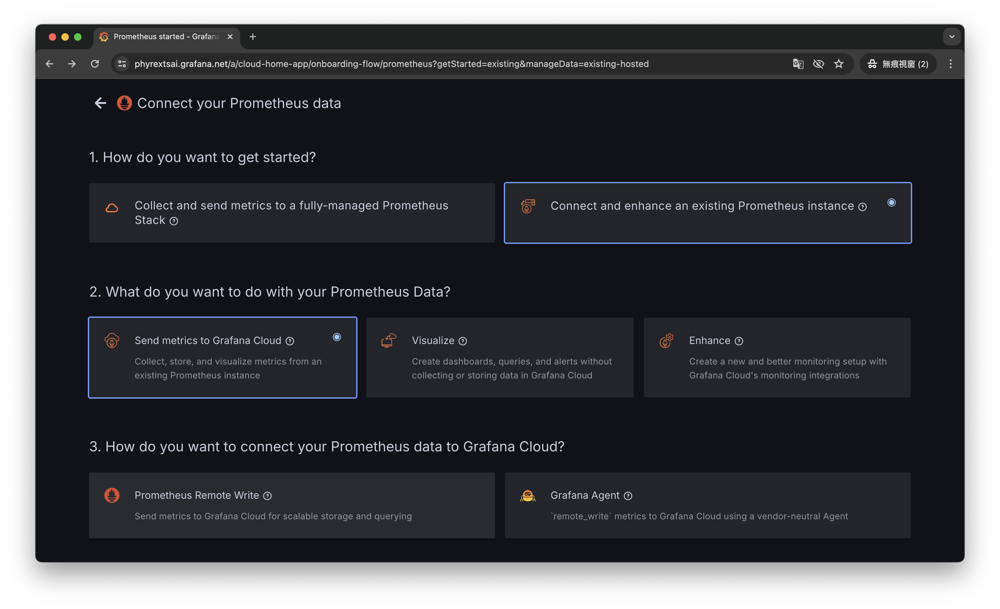
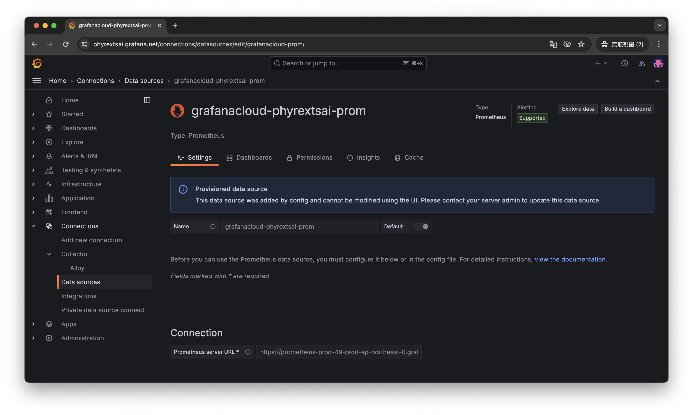
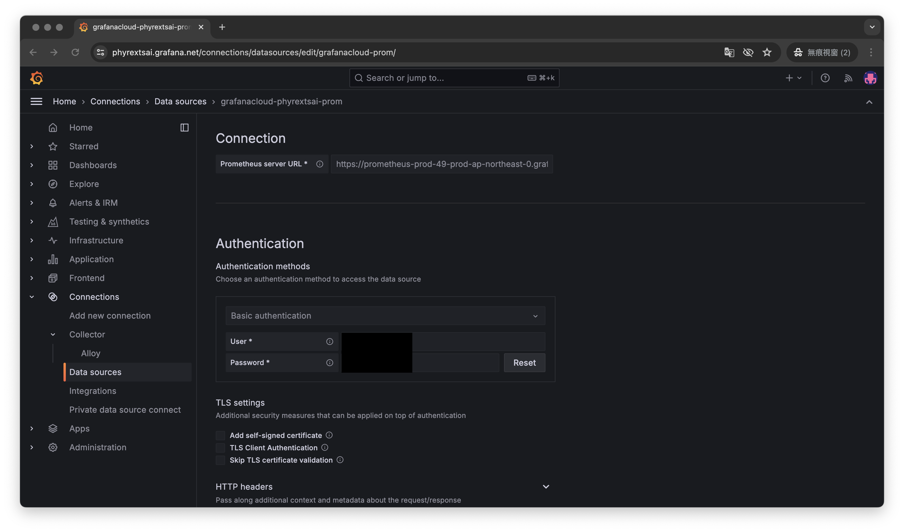
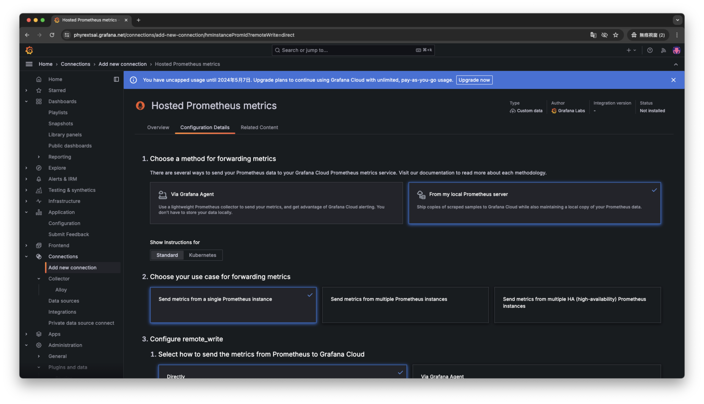

# Express + Grafana + Prometheus

## Introduce
Connect Express server with Grafana Cloud & Prometheus

## Technical Stack
- Express
- Grafana
- Prometheus
- Loki

## Setup
- Download [Prometheus](https://prometheus.io/download/)
- Register [Grafana Cloud](https://grafana.com/), which is **Free**
- Setup Prometheus on Grafana Cloud 
  
  
- Connect Data Store, Connections > Data Stores > Settings

- Copy `Prometheus server URL`, `User` and `Password` to `prometheus.yml`

- Setup `Access Policy token`


## Local Run

1. Setup `.env` Configuration
```s
# .env should include these configuration
APP_NAME=

GRAFANA_CLOUD_PROMETHEUS_USERNAME=
GRAFANA_CLOUD_PROMETHEUS_PASSWORD=
GRAFANA_CLOUD_PROMETHEUS_URL=

GRAFANA_CLOUD_LOKI_URL=
GRAFANA_CLOUD_LOKI_USER=
GRAFANA_CLOUD_LOKI_PASSWORD=
```

2. Run `npm run yaml`, to setup the configuration and create `prometheus.yaml`

3. Start both `Prometheus` and `Express Server`

4. Run Prometheus
```sh
# For copy prometheus to the current folder
# otherwise should locate the prometheus' path
./prometheus --config.file=./prometheus.yaml
```

5. Run Express Server
```sh
# Swagger autogen, when change the API you can run this command to regenerate the API for Swagger UI
npm run swagger-autogen

# Start Server
npm start
```

#### Swagger UI
Connect `http://localhost:3000/api-docs` for API document

## Monitoring Metrics

- Connect `http://localhost:9090/metrics` for Prometheuss  
- Connect `http://localhost:3000/metrics` for Express Server
